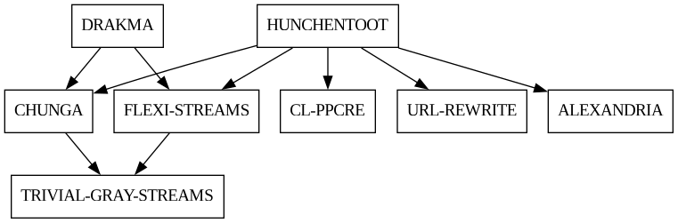
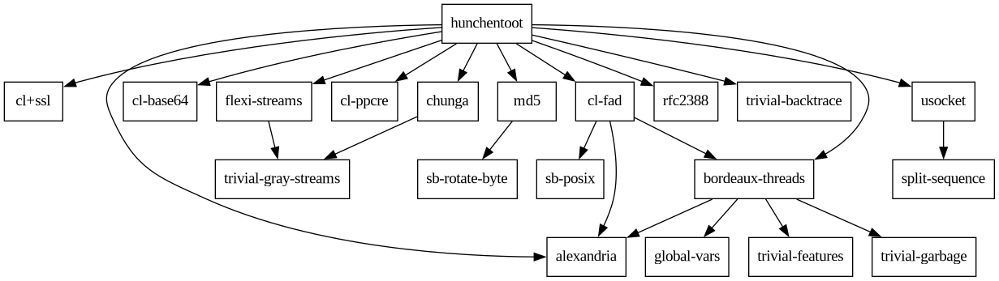

<a id="x-28DOT-STUFF-3A-40OVERVIEW-20MGL-PAX-3ASECTION-29"></a>

## Overview

### Table of Contents

- [1 Example applications][3493]

###### \[in package DOT-STUFF with nicknames GV\]
Convenience tools for Graphviz dot file creation.

<a id="x-28DOT-STUFF-3AWITH-NEW-DOT-FILE-20MGL-PAX-3AMACRO-29"></a>

- [macro] **WITH-NEW-DOT-FILE** *(FILE &KEY (NAME "D") (TYPE :DIGRAPH) (IF-EXISTS :SUPERSEDE)) &BODY BODY*

    Open `FILE` for writing, put Graphviz boilerplate there and run `BODY` with
      [`*GV-STREAM*`][96a7] bound as a write stream to the file.
    
    `TYPE` controls what goes in the boilerplate - the boilerplate is
    
    ```
      graph|digraph <NAME> {
        (...)
      }
    ```
    
    `IF-EXISTS` is as in [`OPEN`][6547].

<a id="x-28DOT-STUFF-3ALINK-20FUNCTION-29"></a>

- [function] **LINK** *FROM TO &OPTIONAL (TYPE 'LINK)*

    Print a graphviz link. `FROM` and `TO` are node names. `TYPE` is used as "type"
    attribute to the link

<a id="x-28DOT-STUFF-3ALABEL-20FUNCTION-29"></a>

- [function] **LABEL** *ID NAME ATTRS*

    Print a graphviz node `ID` with `LABEL` and other attributes to [`*GV-STREAM*`][96a7].
    
    ATTRs should be a list of name-values (plist style).

<a id="x-28DOT-STUFF-3A-2AGV-STREAM-2A-20VARIABLE-29"></a>

- [variable] **\*GV-STREAM\*** *\#\<SYNONYM-STREAM :SYMBOL SB-SYS:\*STDOUT\* {1002477363}>*

    String to user for graphviz print operations.

<a id="x-28DOT-STUFF-3ALINK-TO-MANY-20FUNCTION-29"></a>

- [function] **LINK-TO-MANY** *FROM TO &OPTIONAL (TYPE 'LINK)*

    Print a graphviz link from one node (`FROM`) to several (`TO`, a list).

<a id="x-28DOT-STUFF-3A-40CL-APPLICATIONS-20MGL-PAX-3ASECTION-29"></a>

### 1 Example applications

<a id="x-28DOT-STUFF-3ADRAW-SOME-DEPS-20FUNCTION-29"></a>

- [function] **DRAW-SOME-DEPS** *FILE ROOT-NODE-NAMES SINK-NAMES TO-NAME-FN FROM-NAME-FN EXPAND-FN*

    Make a graphviz `FILE` containing dependencies generated from `ROOT-NODE-NAMES` using `EXPAND-FN`.
    
    `EXPAND-FN` takes an existing node and returns list of pairs to add.
    
    `SINK-NAMES` are no longer expanded.
    
    `TO-NAME-FN` and `FROM-NAME-FN` are used to convert node objects to name or create
    node object from its name.
    
    See examples [`DRAW-SYSTEM-DEPS`][7652] and [`DRAW-PACKAGE-DEPS`][b558].

<a id="x-28DOT-STUFF-3ADRAW-PACKAGE-DEPS-20FUNCTION-29"></a>

- [function] **DRAW-PACKAGE-DEPS** *FILE PACKAGE-LIST KNOWN*

    Draw dependencies of CL packages from `PACKAGE-LIST` into graphviz `FILE`.
    
    The COMMON-LISP package is not shown as a dependency for simple view.
    
    Example:
    
    ```
    (gv:draw-package-deps "/tmp/hunchentoot.gv" '(drakma hunchentoot) ())
    ```
    
    

<a id="x-28DOT-STUFF-3ADRAW-SYSTEM-DEPS-20FUNCTION-29"></a>

- [function] **DRAW-SYSTEM-DEPS** *FILE SYSTEMS-LIST SINKS*

    Draw dependencies of an ASDF systems in `SYSTEMS-LIST` to a graphviz `FILE`.
    
    Example: draw dependencies of Hunchentoot asdf package, do not expand cffi and cl+ssl.
    
    ```
    (gv:draw-system-deps "/tmp/hunchentoot.gv" '(hunchentoot) '(cl+ssl))
    ```
    
    

  [3493]: #x-28DOT-STUFF-3A-40CL-APPLICATIONS-20MGL-PAX-3ASECTION-29 "Example applications"
  [6547]: http://www.lispworks.com/documentation/HyperSpec/Body/f_open.htm "OPEN (MGL-PAX:CLHS FUNCTION)"
  [7652]: #x-28DOT-STUFF-3ADRAW-SYSTEM-DEPS-20FUNCTION-29 "DOT-STUFF:DRAW-SYSTEM-DEPS FUNCTION"
  [96a7]: #x-28DOT-STUFF-3A-2AGV-STREAM-2A-20VARIABLE-29 "DOT-STUFF:*GV-STREAM* VARIABLE"
  [b558]: #x-28DOT-STUFF-3ADRAW-PACKAGE-DEPS-20FUNCTION-29 "DOT-STUFF:DRAW-PACKAGE-DEPS FUNCTION"

* * *
###### \[generated by [MGL-PAX](https://github.com/melisgl/mgl-pax)\]
